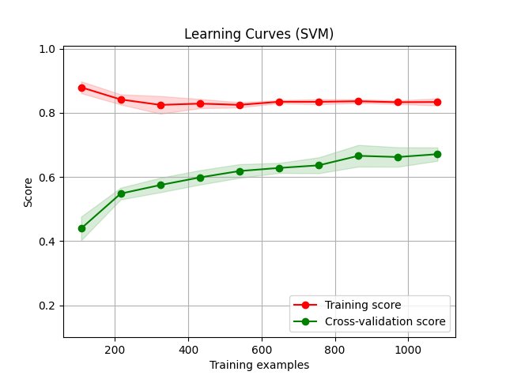
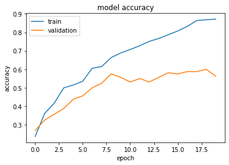

# Reporte del Proyecto

## Primera Idea : ID3 y Naive Bayes

La primera idea que tuvimos para darle solución al problema fue usar Naive Bayes o Árboles de decisión con las extracción de las siguientes caracteristicas en solo los primeros 30 segundos de las canciones en formato mp3:

- **Chroma Feature**: Es una poderosa herramienta para analizar características musicales cuyos tonos se pueden categorizar significativamente y cuya afinación se aproxima a la escala de temperamento igual.
- **Spectral Bandwidth**: Calcula el ancho de banda espectral de orden p.
- **RMS**: Calcula root-mean-square (RMS) para cada frame, ya sea de las muestras de audio o de un espectrograma.
- **Spectral Centroid**: El centroide espectral indica dónde se encuentra el "centroide" del sonido y se calcula de acuerdo con el promedio ponderado de la frecuencia del sonido
- **Rolloff espectral**: La derivación espectral (Spectral Rolloff) es una medida de la forma de la señal, que representa la frecuencia en un porcentaje específico de la energía espectral (como el 85%).
- **Zero crossing** rate (Taza de Cruce Cero): La velocidad de cruce por cero es la velocidad a la que cambia un signo de señal, es decir, el número de veces que una señal de voz cambia de positivo a negativo o de negativo a positivo en cada cuadro.
- **Mel-Frequency Cepstral Coefficients (MFCCs)**:  El coeficiente cepstral de frecuencia de mel (MFCC) de una señal es un conjunto generalmente compuesto de 10-20 características, que pueden describir de manera concisa la forma general  de la envoltura del espectro y modelar las características del habla.
- **dbfs**: Significa "decibelios a escala completa". Es una abreviatura utilizada para definir los niveles de amplitud en decibelios en sistemas digitales en base al máximo nivel disponible. Actualmente el término "dBFS" se utiliza con referencia a la definición del estándar AES-17.

### Efectividad obtenida en promedio

| Algoritmo   | Valor Obtenido |
| ----------- | :------------: |
| Naive Bayes |     0.356     |
| ID3         |     0.347     |

## Refinando las ideas que se tienen hasta el momento

Se decidió comprobar si el intervalo de tiempo que se toma de la canción para la extracción de sus características afecta notablemente la efectividad de los algoritmos, para ello se realizaron varias corridas tomando 90 segundos y toda la canción.

Al mismo tiempo, por contenido dado en clases, aprendimos que es buena idea escalar los datos para normalizarlos.

Además luego de realizar una búsqueda nos percatamos que para el trabajo con canciones y especifícamente para la extración de sus características se utiliza con frecuencia el formato .wav pues este no presenta compresión de sonido. Para la conversión de las canciones de formato .mp3 a .wav utilizamos la librería de python `pydub`, específicamente la función `AudioSegment`.

Con todo esto se probó las ideas que se tenían hasta el momento y estos fueron los resultados.

### Efectividad obtenida en promedio

| Algoritmo   | 90 s | Completa |
| ----------- | :--: | :------: |
| Naive Bayes | 0.52 |   0.52   |
| ID3         | 0.55 |   0.58   |

Por estos resultados es preferible analizar la canción en su totalidad.

## Segunda Idea : Redes Neuronales (Keras)

Pensamos en utilizar este algoritmo antes de verlo en conferencias por lo que no definimos los parámetros de la forma más correcta para el problema en cuestión, los primeros valores que se utilizaron fueron:

- epoch: 100
- capa inicial: 256
- capa oculta1: 128
- capa oculta2: 64
- capa salida (softmax): 5

El valor de la capa de salida si es correcta pues el dataset contiene solo 5 géneros musicales.

Los valores de la capa inicial y epoch no son los más adecuados para nuestro problema:

- Para la capa inicial lo mejor es escoger la potencia de 2 mayor que la cantidad de datos que se tienen, como tenemos un dataset de 492 canciones este valor sería 512.
- Por otro lado al tener un valor para epoch tan elevado, sucede que la red neuronal se aprende el conjunto de datos de memoria, específicamente en nuestro caso era a partir de la etapa 30.

Durante el entrenamiento, el modelo entrenará solo en el conjunto de entrenamiento y validará evaluando los datos en el conjunto de validación. Por lo que el modelo está aprendiendo las características de los datos en el conjunto de entrenamiento, tomando lo que aprendió de estos datos y luego prediciendo en el conjunto de validación. Durante cada época, se podrá observar no solo los resultados de pérdida y precisión para el conjunto de entrenamiento, sino también para el conjunto de validación.

Se probó tomando `validation_split=0.2` y `validation_split=0.1`, estos son los resultados:

| Validacion | Resultado |
| ---------- | :-------: |
| 0.2        |   0.75   |
| 0.1        |   0.78   |

En este punto podemos dar por desechada la primera idea pues el porciento de efectividad con el algoritmo de keras es mucho más alto que los alcanzaddo por ID3 y Naive Bayes.

## Tercera idea: KNN

Se encontró un artículo donde, para darle solución a un problema muy similar al que se presenta, utilizaban KNN por lo que decidimos probar esta vía para comparar los resultados con los que teníamos hasta al momento.

Se toma `n_neighbors=5`, igual que la solución de la que se habla anteriormente y `weights='distance'` pues los puntos que esten más cercanos al que se quiere clasificar tendrán mayor influencia sobre el veredicto de a qué género pertenece. Luego por esta vía obtenemos un 0.75 de efectividad en promedio.

## Cuarta idea: SVM

Ya para agotar todas las las vías posibles para resolver el problema se probó SVM con el que se obtuvo un 0.74 de efectividad.

Se tomó para los parámetros los siguientes valores:

- `decision_function_shape='ovo'` : Para poder usar eel algoritmo de vector de soporte para n clases pues por defecto solo se utiliza para valores binarios.
- `kernel = 'rbf'`: Para especificar el tipo del kernel que utilizará el algoritmo, se utiliza 'rbf' pues los datos no son linealmente separables.
- `class_weight='balanced'`: Este modo utiliza los valores de Y para ajustar automáticamente los pesos inversamente proporcionales a las frecuencias de clase en los datos de entrada como .n_samples / (n_classes * np.bincount(y)).

Luego se obtienen mejores resultados con: Keras, KNN y SVM. Ahora analicemos a más detalle estos resultados.

## Análisis de las curvas de aprendizajes

    
    
    
    
    

Como podemos notar en las imágenes anteriores los algoritmos están realizando Overfitting y hay falta de datos.

En este punto de la investigación nos dimos cuenta que el conjunto de datos que estábamos utilizando para entrenar y evaluar los algoritmos está lejos de ser correcto pues tenía canciones que no estaban bien clasificadas según el género al que realmente pertenecen y contenía datos repetidos, lo cual puede ser la razón por la que los algoritmos estaban realizando Overfitting.

Dicho lo anterior, no tiene sentido seguir analizando los resultados de los algoritmos propuestos pues los datos que utilizan no son fiables.

## Nuevo conjunto de datos

GTZAN+ es una base de datos musical compuesta por 15 géneros musicales. Es una extensión de la base de datos GTZAN aumentada por los siguientes 5 géneros musicales afro: Bikutsi , Makossa , Bamileké , Salsa y Zouk . Cada género en GTZAN+ está representado por 100 archivos ".wav" de 30 segundos cada uno. La base de datos GTZAN original se ha utilizado en varias investigaciones que se han realizado relacionadas con la clasificación de canciones según su género, por lo que parece prudente y confiable utilizarla para comprobar la efectividad de nuestros algoritmos.

Luego los resultados que se tiene con GTZAN+ son:

| Algoritmo   | Resultado |
| ----------- | :-------: |
| Naive Bayes |  0.5125  |
| ID3         |  0.5055  |
| KNN         |  0.6805  |
| SVM         |  0.701   |
| Keras       |  0.7125  |

En este punto podemos decir que los mejores resultados son los dados por KNN, SVM y Keras. Veamos como se comportan las curvas de aprendizaje.

## Análisis de las nuevas curvas de aprendiaje

    
    
    
    
    

 

Como nos podemos percatar seguimos teniendo el mismo problema de overfiting que teníamos con el dataset original por lo que dejando a un lado las incongruencias en el dataset anterior los algoritmos no estan funcionando como se esperaría.

## Intento reducir el overfiting

Para combatir el overfiting dos de las maneras más comunes son: simplificar las dimensiones del modelo y utilizar la validación cruzada para estimar el rendimiento de los modelos, ya que este se utiliza para proteger contra el overfit en un modelo, particularmente en un caso donde la cantidad de datos puede ser limitada, el cual es precisamente nuestro caso.

### Reducción de dimensiones

Verificamos la matriz de correlación para determinar que variables están altamente correlacionadas. Luego si dos variables están correlacionadas, se puede usar solo una de ella para el análisis.

Al observar la matriz podemos percatarnos que existen variables que se pueden eliminar, estas son: rollof, spectral_centroid, spectral_bandwidth, mfcc1, mfcc2, mfcc8 y mfcc10. Luego la matriz de correlación queda:

Veamos cómo influyó este cambio en la efectividad y las curvas de aprendizaje de los algoritmos:

| Algoritmo   | Resultado |
| ----------- | :-------: |
| Naive Bayes |   0.52   |
| ID3         |   0.44   |
| KNN         |   0.66   |
| SVM         |   0.69   |
| Keras       |   0.66   |

#### **Curvas de aprendizajes**

    
    
    
    
    

 

Como podemos observar que en las curvas de aprendizaje hubo una pequeña mejoría pero la efectividad de los algoritmo disminuyó un poco. Veamos si la otra opción para proteger los algoritmos de overfiting nos ayuda más.

### Utilizando Cross Validation

Decidimos utilizar como método de validación cruzada Stratified Group KFold. Veamos si afecta positivamente los algoritmos:

#### **Efectividad en promedio**

| Algoritmo   | Resultado |
| ----------- | :-------: |
| Naive Bayes |   0.45   |
| ID3         |   0.49   |
| KNN         |   0.69   |
| SVM         |   0.68   |
| Keras       |   0.68   |

#### **Curvas de Aprendizajes**

    
    
    
    
    

 

Las curvas de aprendizajes se quedaron prácticamente igual pero la efectividad aumentó un poco por lo podemos decir que es beneficioso de alguna manera.

### Añadiendo Dropout a Keras

La capa Dropout establece aleatoriamente las unidades de entrada en 0 con una frecuencia de `rate` en cada paso durante el tiempo de entrenamiento, lo que ayuda a evitar el sobreajuste. Las entradas que no se establecen en 0 se escalan en 1/(1 - tasa) de modo que la suma de todas las entradas no cambia.

Definimos el parámetro `rate` con 0.5, pues si el valor es muy pequeño entonces se mantiene el overfit y si por el contrario es un valor muy alto entonces dismuye la efectividad y realiza Underfit.

Con esta modificación al algoritmo obtenemos un porciento de efectividad de 0.65 en promedio y la curva de aprendizaje se comporta de la siguiente manera:

|

### Añadiendo L2 a Keras

La idea detrás de este tipo de regularización es reducir el valor de los parámetros para que sean pequeños.
Esta técnica introduce un término adicional de penalización en la función de coste original (L), añadiendo a su valor la suma de los cuadrados de los parámetros (ω).

batch_size: La normalización en lotes consiste básicamente en añadir un paso extra, habitualmente entre las neuronas y la función de activación, con la idea de normalizar las activaciones de salida. Se utilizó batch_size=128.

|

Al ver que la efectividad disminuyó radicalmente y que la curva de aprendizaje empeoró decidimos descartar la utilización de L2, además la curva de aprendizaje comenzo a dar underfiting.
### Aumento de datos para audio mediante la inyección de ruido

El aumento de datos ayuda a generar datos sintéticos a partir de un conjunto de datos existente, de modo que se pueda mejorar la capacidad de generalización del modelo por lo que puede ser beneficioso para los algoritmos que tenemos hasta el momento.

Para generar datos sintácticos para audio, podemos aplicar inyección de ruido, cambio de tiempo, cambio de tono y velocidad. Modificar el tiempo, el tono y la velocidad no nos parece correcto porque esto cambios podrían influir en que la "nueva canción" cambie de género, por lo que decidimos probar la inyección de ruido.

#### Efectividad promedio

| Algoritmo   | Resultado |
| ----------- | :-------: |
| Naive Bayes |   0.27   |
| ID3         |   0.32   |
| KNN         |   0.42   |
| SVM         |   0.41   |
| Keras       |   0.39   |

#### Curvas de Aprendizaje

    
    
    
    
    

Como podemos notar todos los algoritmos dan peores resultados por lo que puede ser, que la inyección de ruido traiga consigo la modificación de las características del audio a tal punto que el dato sintético no pertenezca al mismo género que el audio original.

# Conclusiones

Después de haber probado diferentes algoritmos con varias modificaciones podemos concluir los mejores resultados en cuanto a la efectividad son KNN, SVM y Keras con Dropout. Los 3 utilizando reducción de las dimensiones del modelo y cross-validation; pero, si verificamos las curvas de aprendizaje podemos notar que KNN realiza un Overfiting perfecto por lo que queda rotundamente descartado.

Por otro lado, SVM no parece ser un mal algoritmo para clasificar canciones según el género, solo que creamos que necesita más datos, los cuales nos son difíciles de obtener; por lo que nos quedamos con Keras que tiene una efectividad de 0.65, que es muy similar a la de SVM pero la curva de aprendizaje se comporta mejor.

## Retomando la investigación

### Quinta idea: Random Forest

Este algoritmo lo probamos, al inicio de la investigación, con nuestro propio dataset y los resultados no fueron para nada significativos, por lo que descartamos por completo la idea; por este motivo nunca se llegó a porbar con el dataset GTZAN+. Veamos que resultados podemos llegar a tener reafirma si hicimos bien en descartarla.

La efectividad en promedio es de 0.70. Veamos como se comporta la curva de aprendizaje.

Random Forest consta de muchos árboles de decisión combinados por lo que es de esperar que obtenga un resultado más preciso en comparación con ID3.

### Explorando de soluciones con algoritmos no supervisados

En la exposición del proyecto nos sugirieron que también se podría utilizar para nuestro problema algoritmos no supervisados por lo que decidimos explorar por esta vía.

En los algoritmos no supervisados no tenemos la posibilidad de directamentte clasificar los datos según el género al que pertenecen, por lo que se intentará agrupar los datos por género utilizando 15 clusters, uno por cada género.

Para valorar ell rendimiento de los algoritmos nos basaremos en 3 métricas: homogeneidad, integridad y coeficiente de silhouette.

### Sexta idea: K-Means

Para este algoritmo tomamos `init = random` pues en clase práctica vimos que al seleccionar los centroides de manera aleatoria se podría obtener un mejor resultado.

Los valores de las métricas son:

| Métrica   | Valor |
| ----------- | :-------: |
| Homogeneidad |   0.39   |
| Integridad   |   0.40   |
| Coeficiente de silhouette    |   0.09  |

Veamos como se ven los clusters gráficamente:

Se obtuvieron valores bajos de homogeneidad e integridad, lo que indica que los elementos en los clusters no pertencen a una única clase, además de que no hay un alto número de elementos de una misma clase en un mismo cluster. Por otro lado se obtuvo un valor del coeficiente de silhouette promedio cercano a 0, lo que indica que casi todos los clusters están solapados. Todo esto se reafirma al observar la gŕafica anterior.

También se probó el mismo algoritmo tomando `init = kmeans++` para comparar si un cambio a la hora de seleccionar los centroides varía los resultados.

| Métrica   | Valor |
| ----------- | :-------: |
| Homogeneidad |   0.39   |
| Integridad   |   0.40   |
| Coeficiente de silhouette    |   0.10  |

Como se puede notar prácticamente no hay cambios.

### Séptima idea: K-Medioide

Como no se obtuvieron resultados muy satisfactorios con K-Means, decidimos probar con K-Medioide.
Al igual que con K-Means se decidio probar primeramente con init='random', y se obtuvieron los
siguientes resultados:

| Métrica   | Valor |
| ----------- | :-------: |
| Homogeneidad |   0.36   |
| Integridad   |   0.39   |
| Coeficiente de silhouette    |   0.06  |

Luego probamos utilizando init='k-means++' y se obtuvo:

| Métrica   | Valor |
| ----------- | :-------: |
| Homogeneidad |   0.33   |
| Integridad   |   0.34   |
| Coeficiente de silhouette    |   0.03  |

Como podemos observar, disminuyo el por ciento de cada una de las metricas en comparacion con la
seleccion de los centroides aleatoriamente.
Estos resultados con respecto a los valores obtenidos con K-Means, fueron un poco mas bajos.

### Octava Idea: DBSACN
Como con K-Means y K-Medioide, no se obtuvieron resultados muy altos, decidimos probar con DBSCAN,
para ver si era capaz de inferir los 15 clusters que exiten por genero.

Se obtuvo el siguiente resultado:
FOTO DE DBSCAN

Coloco todos los datos en el mismo cluster.

### Novena Idea: Agrupamiento por aglomeracion

Por ultimo, decidimos probar con el metodo de agrupamiento por aglomeracion, el cual es un metodo de
agrupamiento jerarquico.

Se probo con la distancia euclideana y con linkage (criterio de enlace) 'ward', 'complete' y 'averaga'.

Se obtuvieron los siguientes resultados:

Criterio ward

| Métrica   | Valor |
| ----------- | :-------: |
| Homogeneidad |   0.36   |
| Integridad   |   0.39   |
| Coeficiente de silhouette    |   0.07  |

Los resultados son muy similares a los resultados de K-Means, aun los clusters se encuentran solapados.

Criterio complete

| Métrica   | Valor |
| ----------- | :-------: |
| Homogeneidad |   0.25   |
| Integridad   |   0.39   |
| Coeficiente de silhouette    |   0.08  |

La homogeneidad disminuyo respecto al valor del criterio ward, la integridad se mantuvo igual y 
el coeficiente de silhoutte no aumento practicamente nada.

Criterio average
| Métrica   | Valor |
| ----------- | :-------: |
| Homogeneidad |   0.02   |
| Integridad   |   0.33   |
| Coeficiente de silhouette    |   0.10  |

La homogeneidad disminuyo considerablemente con respecto al valor del criterio ward y el criterio complete, lo que indica que la mayoria de los elementos no pertenecen a la misma clase, la integridad tambien disminuyo un poco y el coeficiente de silhoutte no aumento practicamente nada.

## Bibliografía

- [Procesando audio con Python](https://programmerclick.com/article/4979571746/)
- [Clasificar géneros de canciones a partir de datos de audio con Python](https://gusintasusilowati.medium.com/classify-song-genres-from-audio-data-4d5f9982c9e)
- [Conozca la extracción de funciones de audio en Python](https://towardsdatascience.com/get-to-know-audio-feature-extraction-in-python-a499fdaefe42)
- [Clasificación de géneros musicales usando CNN (Convolutional Neural Networks)](https://www.clairvoyant.ai/blog/music-genre-classification-using-cnn)
- [Documentación de sklearn.svm](https://scikit-learn.org/stable/modules/generated/sklearn.svm.SVC.html)
- [Cómo seleccionar núcleos de máquinas de vectores de soporte](https://www-kdnuggets-com.translate.goog/2016/06/select-support-vector-machine-kernels.html?_x_tr_sl=en&_x_tr_tl=es&_x_tr_hl=es&_x_tr_pto=sc)
- [Conjunto de datos GTZAN+](https://perso-etis.ensea.fr/sylvain.iloga/GTZAN+/)
- [Aumento de datos para audio](https://medium.com/@makcedward/data-augmentation-for-audio-76912b01fdf6)
